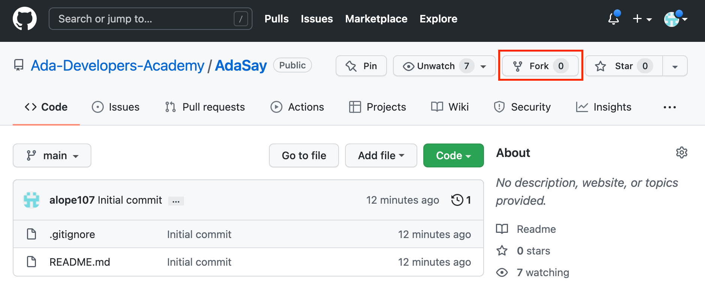

# AdaSay

This repository gives us a chance to practice using git and virtual environments. We will take a small program and practice how we can manage its dependencies using a virtual environment. We'll also practice forking and cloning a repository, as well as making a commit and pushing changes.

## Forking and Cloning the Repository

1. To start, we want make our own copy of the GitHub repository to work with. We do this by _forking_ the repository. Click the **Fork** button on GitHub. This new repository copy will be owned by your GitHub account.



2. Next, we want to copy the code from GitHub down to our computer. We will do this by cloning the code. Click the green **Code** Button, then copy the URL from the dropdown that appears.


3. Open a terminal on yor computer, and navigate to the directory where you wish to copy this exercise's code to. Once you are in the desired directory, run this command, using the URL you copied in the previous step: 

```git clone YOUR_REPO_URL```

4. After the repository is copied, move into the repository directory.

```cd AdaSay```

5. Open the code in VS Code.

```code .```